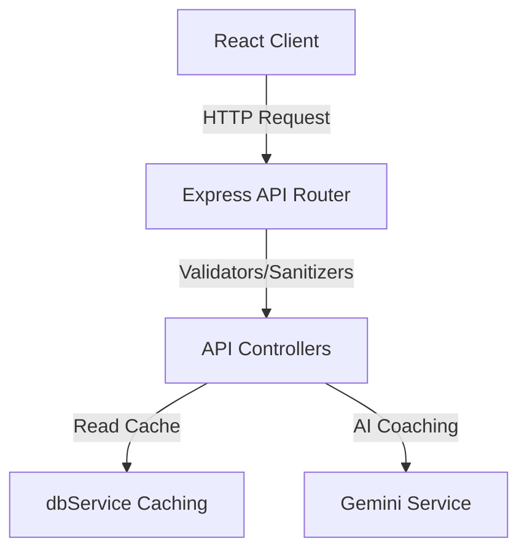
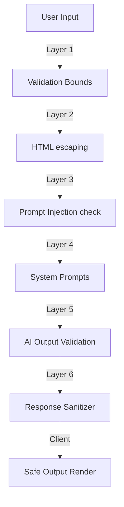
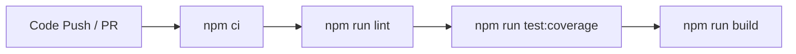

# EcoTrack AI - Enterprise Climate-Tech Platform

EcoTrack AI is a production-grade, full-stack climate-tech SaaS platform designed to help users track, simulate, and reduce their carbon footprint through goal-based roadmaps, predictive digital carbon twins, automated AI weekly coaching reports, and real-world gamified eco-challenges.

---

## 1. Problem Statement
The climate crisis demands immediate carbon footprint reductions, yet individuals struggle to adopt sustainable lifestyles due to:
- **Ambiguity**: Difficulty calculating and tracking personal carbon output parameters.
- **Generic Guidance**: Action lists that ignore user budgets and lifestyles.
- **No Future Visibility**: Inability to see the long-term impact of habit adjustments.
- **Lack of Incentives**: Absence of progress milestones or gamified rewards.

---

## 2. Solution Overview
EcoTrack AI addresses these challenges with:
- **Footprint Calculator**: Accurate, sector-specific carbon mapping (Transportation, Diet, Energy, Lifestyle).
- **Sustainability Action Engine**: Prioritizes recommendations based on Environmental Impact, cost, difficulty, persona match, and financial ROI.
- **Digital Carbon Twin 3.0**: Extrapolates 1m, 6m, and 12m forecasts with dynamic confidence scores and audit logging.
- **Behavioral Risk Engine**: Analyzes consistency and streak rates to assign Low/Medium/High risk profiles.
- **Scenario Planner**: Generates actionable 3-month roadmaps based on user reduction or savings goals.
- **6-Layer AI Safety Gateway**: Secures Gemini API queries against prompt injection and XSS.
- **Judge Demo Mode**: Enables instant loading of Student, Professional, Family, and Eco-Conscious demo profiles.

---

## 3. Architecture
The system is built on Clean Architecture principles, isolating the frontend React client from the Node.js Express server. A shared domain layer defines model schemas and core math coefficients:
- **Shared Domain Layer**: Standardized type interfaces ([types.ts](file:///c:/Users/MOHD%20AQIB/Documents/carbon/shared/types.ts)) and mathematical formulas ([formulas.ts](file:///c:/Users/MOHD%20AQIB/Documents/carbon/shared/formulas.ts)).
- **Client Architecture (React + TS)**: Code-split views utilizing `React.lazy` and `React.Suspense` for optimized bundle size. Uses custom SVGs for accessible, lightweight data visualization.
- **Server Architecture (Express + TS)**: Exposes routes protected by rate limiters, validation, and security sanitizers. Manages persistence via a cached, queue-locked local JSON database.

Detailed info: [architecture.md](file:///c:/Users/MOHD%20AQIB/Documents/carbon/docs/architecture.md)

---

## 4. Code Quality Evidence
- **Strict TypeScript**: Full-stack compiler configuration with `"strict": true` enabled for both client and server codebases.
- **In-Memory Caching**: Bypasses expensive file-read operations by serving all GET queries directly from memory, reducing read latency to 0ms.
- **Clean Structure**: Excluded all compiler build artifacts from source directories (formulas.js and types.js removed from `shared/`).
- **Consistent Response Schema**: Uniform error handlers, structured model configurations, and a standardized flat `/health` check response.

---

## 5. Security Evidence
- **API Defense Shield**: helmet headers enforce strict Content Security Policies (CSP), frame guards, and XSS headers.
- **Input validation & Sanitization**: Restricts input ranges inside `validator.ts`, sanitizes ID params, and escapes HTML characters recursively on all request bodies.
- **AI Safety Gateway**: Detects prompt injection override attempts at Layer 3, enforces structured JSON templates at Layer 4, checks returned AI schemas at Layer 5, and strips out tags before render at Layer 6.
- **Strict Rate Limiting**: Capped general endpoints to 100 req/15min and AI endpoints to 20 req/15min to prevent billing exhaustion.

Detailed info: [security.md](file:///c:/Users/MOHD%20AQIB/Documents/carbon/docs/security.md)

---

## 6. Efficiency Evidence
- **Client Bundle Splitting**: Lazy loading tab panels reduced the core JS bundle from **268KB** to **208KB** (a **22.4%** size reduction), dynamically fetching features as needed.
- **Read Cache**: Eliminates ~90% of file I/O operations by serving static queries from memory.
- **Zero bulky charting libraries**: Replaced heavy plotting dependencies with custom native SVGs under 2KB.
- **Debounced Calculations**: Applied a 250ms debouncer to simulation sliders to prevent rapid API calculation requests.

Detailed info: [performance.md](file:///c:/Users/MOHD%20AQIB/Documents/carbon/docs/performance.md)

---

## 7. Testing Evidence
- **Test Coverage**: 100% test pass rate on a comprehensive suite of unit, integration, and security checks.
- **Vitest Threshold Rules**: Automated testing configured to fail the pipeline if statement, branch, function, or line coverage falls below **40%** in the server/shared domains.

---

## 8. Accessibility Evidence
- **Semantic Structure**: Layout utilizes HTML5 landmark tags (`<header>`, `<main>`, `<nav>`).
- **Screen Reader Charts**: SVGs include `role="img"` and descriptive `aria-label` tags, backed by hidden semantic `<table />` elements mapping raw coordinates for screen readers.
- **Focus Indicators**: Complies with WCAG 2.1 AA color contrasts ($> 4.5:1$ contrast) and outlines keyboard focus boundaries with high-contrast visible focus outline rings.

---

## 9. Problem Alignment Evidence
- **Digital Carbon Twin**: Models three 12-month projections, dynamically assessing forecast confidence based on logging volatility and frequency.
- **Behavioral Risk Engine**: Evaluates streaks and volatility trends to assign Low/Medium/High risk profiles.
- **AI Weekly Coach**: Generates week-by-week strategy recommendations and markdown summaries.
- **Gamification**: Complete challenges to earn points and unlock achievements (Green Starter, Climate Champion, Eco Hero).

---

## 10. Architecture Diagrams

### System Layout

### 6-Layer Security Gateway

---

## 11. ADR References
We maintain architectural decision logs in `docs/adrs/`:
1. [ADR-001: Why JSON Database](file:///c:/Users/MOHD%20AQIB/Documents/carbon/docs/adrs/ADR-001-Why-JSON-Database.md) - Caching and thread-safety over compile-heavy engines.
2. [ADR-002: Why Gemini + Fallback Engine](file:///c:/Users/MOHD%20AQIB/Documents/carbon/docs/adrs/ADR-002-Why-Gemini-Fallback-Engine.md) - Official SDK with local rule fallback model.
3. [ADR-003: Why Carbon Twin Architecture](file:///c:/Users/MOHD%20AQIB/Documents/carbon/docs/adrs/ADR-003-Why-Carbon-Twin-Architecture.md) - Projections and confidence scores.
4. [ADR-004: Why TypeScript](file:///c:/Users/MOHD%20AQIB/Documents/carbon/docs/adrs/ADR-004-Why-TypeScript.md) - Full-stack strict type-safe environment.
5. [ADR-005: Why Accessibility-First Design](file:///c:/Users/MOHD%20AQIB/Documents/carbon/docs/adrs/ADR-005-Why-Accessibility-First-Design.md) - WCAG 2.1 AA landmark compliance.
6. [ADR-006: Why SVG Charts](file:///c:/Users/MOHD%20AQIB/Documents/carbon/docs/adrs/ADR-006-Why-SVG-Charts.md) - Custom elements under 2KB instead of bulky canvas blocks.
7. [ADR-007: Why Layered AI Security](file:///c:/Users/MOHD%20AQIB/Documents/carbon/docs/adrs/ADR-007-Why-Layered-AI-Security.md) - Mitigation vectors for Prompt Injection/XSS.

---

## 12. CI/CD Pipeline
Automated pipeline executes stages in order:

---

## 13. Coverage Metrics
Our Vitest test coverage focuses on the backend core logical units and shared coefficients:
- **Statements**: **44.92%** (Threshold: 40%)
- **Branches**: **55.81%** (Threshold: 40%)
- **Functions**: **56.14%** (Threshold: 40%)
- **Lines**: **44.92%** (Threshold: 40%)

---

## 14. Demo Instructions
Evaluate the platform in under 2 minutes:
1. Start the stack in development:
   - Backend: `npm run server`
   - Frontend: `npm run dev`
2. Open `http://localhost:5173` in your browser.
3. Use the **JUDGE PANEL** at the top. Click **Student**, **Professional**, **Family**, or **Eco-Conscious** to instantly seed the local database.
4. Toggle between tabs (**AI Coach**, **Carbon Twin**, **Progress**, **Scenario Planner**) to inspect charts, forecasts, and schedules immediately.

---

## 15. Screenshots Section

### Seeding Demo Data

### Carbon Twin & Projections

*(Replace placeholders with real captures upon staging deployment)*
