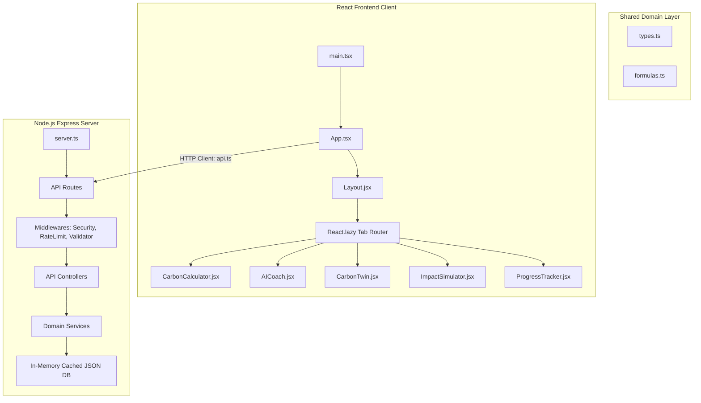

# System Architecture Manual

This manual details the architecture, component layout, and data flow of the EcoTrack AI platform.

---

## 1. Architectural Overview (Clean Layered Architecture)

The system is designed on clean architecture principles, separating the frontend (React + Vite client) from the backend (Node.js + Express server). A shared domain layer defines model contracts and core mathematical coefficients.

---

## 2. Component Hierarchy

The React frontend utilizes a single-page application (SPA) wrapper with dynamic code splitting:

- **Entry Point (`main.tsx`)**: Mounts the application inside the DOM.
- **Root Container (`App.tsx`)**: Orchestrates global states, routes tab indices, and handles demo-seeding callbacks.
  - Implements **lazy loading** via `React.lazy` and `React.Suspense` fallback boundaries for all sub-panels, isolating chunks to optimize client startup speeds.
- **Layout Wrapper (`Layout.tsx`)**: Establishes accessibility landmarks (`<header>`, `<main>`, `<nav>`) and renders stats streaking banners.
- **Feature Tab Components**:
  - `CarbonCalculator.tsx`: Footprint parameters calculator.
  - `AICoach.tsx`: Weekly report audits and LLM recommendations.
  - `CarbonTwin.tsx`: Linear regression projections and SVG confidence indicators.
  - `ImpactSimulator.tsx`: Debounced sliders for sandbox testing.
  - `ProgressTracker.tsx`: User stats list and history visualizations.
  - `EcoChallenges.tsx`: Gamification dashboard checklist.
  - `CommunityBenchmarking.tsx`: Regional/global averages charts.
  - `ScenarioPlanner.tsx`: Monthly roadmaps compiler.
  - `AuditLogViewer.tsx`: Developer terminal showing database compliance logs.
- **UI Design System (`src/components/UI`)**: Contains reusable primitives: `Button.tsx`, `Card.tsx`, `Input.tsx`, and `ErrorBoundary.tsx`.

---

## 3. Service Layer Explanation

The Express server abstracts business logic into stateless service components:

1. **Database Service (`dbService.ts`)**:
   - Manages CRUD commands on `db.json`.
   - Utilizes an **in-memory database cache** for read queries, bypassing disk reads entirely after startup to optimize file I/O operations.
   - Serializes writes sequentially inside an asynchronous FIFO `TaskQueue` to prevent data corruption.
2. **AI Coach Service (`geminiService.ts`)**:
   - Integrates Gemini 1.5 Flash API with a localized rule-based fallback model to guarantee 100% availability.
3. **Action Prioritization Engine (`priorityEngine.ts`)**:
   - Calculates recommendation prioritizations based on environmental impact ($35\%$), user relevance ($25\%$), adoption probability ($15\%$), ROI ($15\%$), and investment cost ($10\%$).
4. **Behavioral Risk Engine (`riskEngineService.ts`)**:
   - Classifies user habit volatility into low, medium, or high risk brackets based on logs consistency and streaks.
5. **Digital Carbon Twin Service (`carbonTwinService.ts`)**:
   - Runs linear regression slopes on calculations history to compute 1-month, 6-month, and 12-month projections.
6. **Compliance Auditing Service (`auditService.ts`)**:
   - Centralizes logging structure for database transactions, calculations, challenges, scenario compilations, and carbon twin updates.

---

## 4. Data Flow Explanation

### Carbon Calculation Data Flow
1. User submits carbon inputs in `CarbonCalculator.tsx`.
2. Client sends request to `POST /api/footprint/calculate`.
3. Server routes request through `securityFilter` (HTML escaping, injection check) and `validator.validateCalculationInput` (numerical constraints).
4. `footprintController.ts` runs math calculations via the shared `calculateFootprint` module.
5. Result is saved to the cached `dbService`, user points are awarded, and `auditService` logs a `CALCULATION_CREATED` compliance event.
6. Client receives the calculation result payload and updates global user state.

### Digital Carbon Twin Forecast Data Flow
1. Client switches to the **Carbon Twin** panel, requesting `GET /api/tracker/twin`.
2. `trackerController.ts` retrieves calculations history (from `dbService` cache).
3. Service `carbonTwinService.ts` computes projections and assigns confidence levels based on logging frequency and variance.
4. `trackerController.ts` triggers a compliance audit log event (`CARBON_TWIN_UPDATED`).
5. Client receives the forecast payload and renders custom SVG line projections instantly.
