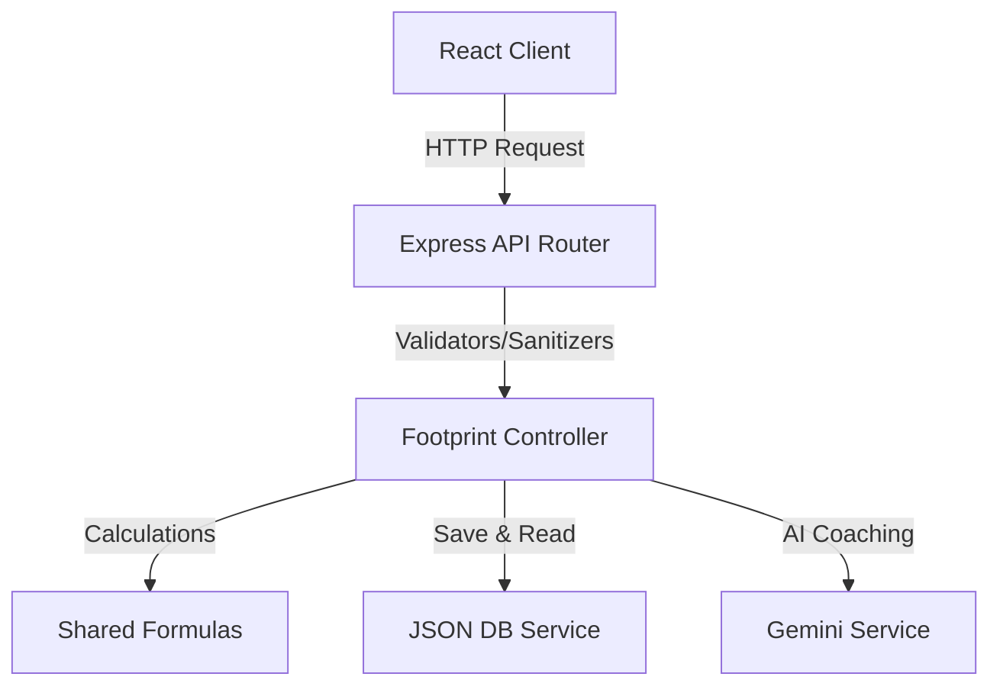

# System Architecture Manual

This manual details the architecture, component layout, and data flow of the EcoTrack AI platform.

## Architectural Guidelines (Clean Architecture)

The system is split into distinct backend (Node.js + Express) and frontend (React + Vite) layers, sharing type interfaces and formula calculations in the root to ensure alignment:

1. **Shared Domain Layer**: Standardized type interfaces (`shared/types.ts`) and mathematical formulas (`shared/formulas.ts`) defining carbon footprint coefficients.
2. **Server Architecture (Express + TS)**:
   - **Routes**: Expose endpoints, apply rate limiters, security filters, and schema validators.
   - **Controllers**: Coordinate requests, fetch data, run core logic, and return responses.
   - **Services**: Abstract databases, risk classification calculations, twin forecasts, and Gemini API calls.
   - **Database (db.json)**: JSON persistence with file locks to avoid writes collision.
3. **Client Architecture (React + TS)**:
   - **Layout**: Renders headers, status trackers, and tab controls.
   - **Services (api.ts)**: Interfaces with the server API.
   - **Hooks (useFetch.ts)**: Standardizes loading states and error handling.
   - **Components**: Focuses on UI display, utilizing custom SVG charts for accessible, lightweight data visualization.

