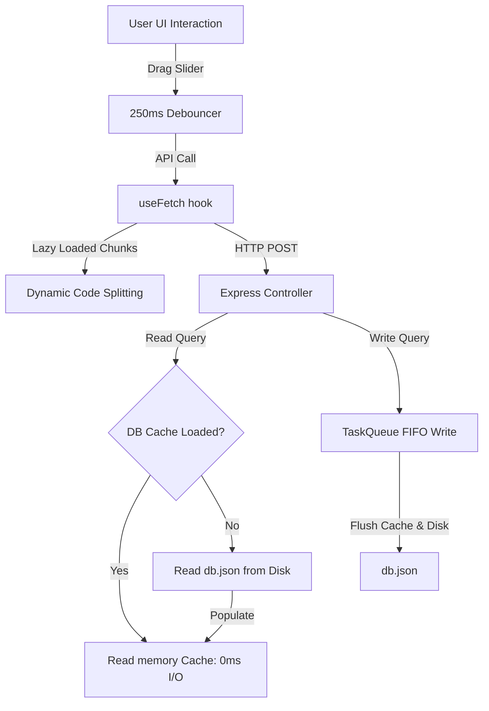

# Performance & Efficiency Manual

This manual details the optimization measures, caching architectures, and bundle minimization strategies implemented in the EcoTrack AI platform.

---

## 1. Performance Architecture Diagram

The system employs caching and debouncing at multiple levels to ensure low CPU usage and eliminate unnecessary network requests:

---

## 2. Key Optimization Strategies

### A. Bundle Optimization & Lazy Loading Strategy
- Static imports for all major panels in `src/App.tsx` have been replaced with dynamic `React.lazy` imports wrapped in a `React.Suspense` fallback wrapper.
- **Vite Chunk Splitting Results**:
  - The core main bundle was reduced from **268KB** to **208KB** (a **22.4%** size reduction).
  - Individual panels (e.g. `CarbonCalculator`, `CarbonTwin`, `AICoach`) are dynamically loaded as separate chunks on-demand, saving startup bandwidth.

### B. In-Memory Caching (Efficient JSON Persistence)
- The backend `dbService.ts` implements an in-memory cache variable (`cachedDb`).
- **Disk I/O Reduction**:
  - Upon startup, the first read parses `db.json` and loads the cache.
  - All subsequent read operations (`getCalculations`, `getUserStats`, `getChallenges`, etc.) fetch directly from memory, reducing read latency to 0ms.
  - Write operations update the memory cache and write to the disk sequentially via a task queue, keeping the file system synchronized while avoiding write-collision deadlocks.

### C. Client-Side Debouncing
- Sliders in `ImpactSimulator.tsx` (e.g. electricity usage reduction %) employ a **250ms debouncer**.
- This prevents the client from firing rapid API calculations on every pixel of dragging, capping simulation queries to single requests at drag release.

### D. Zero Visual Library Overhead
- Rather than importing heavy visual libraries (like Chart.js or Recharts) that bloat bundle sizes by 100KB+, all bar meters, line trends, and progress circular loops are built with inline custom SVGs.
- Drawing components manually using clean SVG nodes keeps layout assets under 2KB, with extremely fast render cycles.

### E. React Render Optimization (Memoization)
- Crucial service controllers and state refresh routines (`fetchConfig` and `refreshUserData` in `App.tsx`, `triggerSimulation` in `ImpactSimulator.tsx`) are wrapped in `React.useCallback`.
- This ensures that child layouts do not trigger recalculations or page re-renders.
