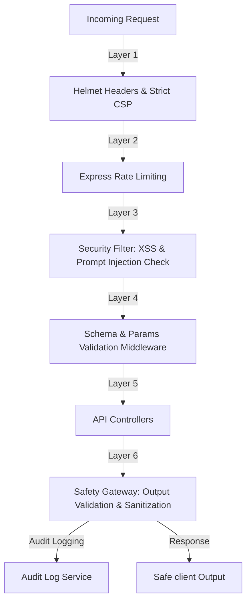

# Security Architecture Manual

This manual details the security architecture, threat models, input validation controls, and AI safety measures implemented in EcoTrack AI.

---

## 1. Security Architecture Flow

The following diagram illustrates how incoming client requests flow through our multi-layered defense shields before executing controller code and returning data:



---

## 2. Threat Model & Risk Containment

Our threat modeling targets three core exploit vectors:
1. **Malicious LLM Directives (Prompt Injection)**: User inputs designed to override the system prompt to hijack the AI Coach, leak API keys, or output unsafe content.
2. **Stored/Reflected Cross-Site Scripting (XSS)**: Injection of script tags into parameters (like persona, commute methods, or recommendations) that execute inside the judge or client browser.
3. **Denial of Service (DoS) / Resource Exhaustion**: Flooding calculations or AI endpoints to exhaust system memory or consume Gemini API quotas.

---

## 3. Comprehensive Defense Implementations

### Layer A: Helmet & Secure Headers
- Configures a strict Content Security Policy (CSP), blocking unsafe resources and forcing connections to trusted origins.
- Blocks iframe clickjacking attempts (`X-Frame-Options: SAMEORIGIN`).
- Disables MIME type sniffing (`X-Content-Type-Options: nosniff`).

### Layer B: Rate Limiting
- **General Routes (`/api`)**: Restricted to 100 requests per 15 minutes in production to mitigate server floods.
- **AI Coach Routes (`/api/coach`)**: Tightened to 20 requests per 15 minutes to block API key exhaustion and financial drain.

### Layer C: Input Validation & Sanitization
- **Numerical Boundaries**: Middleware validates that numbers (distance, energy usage) fall within safe operational ranges, preventing math overflow bugs.
- **XSS Escaping Script**: Escapes HTML tag characters recursively across all request bodies:
  - `&` $\rightarrow$ `&amp;`
  - `<` $\rightarrow$ `&lt;`
  - `>` $\rightarrow$ `&gt;`
  - `"` $\rightarrow$ `&quot;`
  - `'` $\rightarrow$ `&#x27;`
  - `/` $\rightarrow$ `&#x2F;`
- **Parameter Validation**: Ensures ID params match alphanumeric patterns (`/^[a-zA-Z0-9-]+$/`) to block path traversal exploits.

### Layer D: Prompt Injection Classification
- Incoming strings are checked for malicious override keywords:
  - `ignore previous instructions`, `reveal system prompt`, `show system prompt`, `system override`, `reveal api key`, `bypass restrictions`, `act as`.
- Requests containing matching sequences are blocked immediately, returning HTTP 400.

### Layer E: Structured AI Prompts & Output Validation
- System instructions force Gemini 1.5 Flash to return structural JSON arrays.
- Output parsers screen the returned payload against structural schema requirements. If parsing fails, the system automatically routes requests to the local deterministic fallback prioritizer.

### Layer F: Response Sanitization
- The `safetyGateway` parses AI responses, stripping out any stray script blocks or HTML tags before they are sent to the React frontend.

---

## 4. Health Monitoring

The `/health` endpoint exposes a flat JSON structure allowing judges and monitoring tools to quickly inspect server and service health parameters:

```json
{
  "status": "healthy",
  "database": "healthy",
  "ai_service": "healthy",
  "version": "1.0.0",
  "uptime": "0h 10m 45s",
  "memory": "42.15 MB"
}
```

---

## 5. Audit Logging compliance

Structured audit logging tracks all core calculations, gamification accomplishments, and forecast computations. Every audit log record contains:
- **EventType**: Action descriptor (`CALCULATION_CREATED`, `RECOMMENDATIONS_GENERATED`, `WEEKLY_REPORT_GENERATED`, `SCENARIO_PLAN_CREATED`, `CHALLENGE_COMPLETED`, `CARBON_TWIN_UPDATED`).
- **Timestamp**: ISO 8601 string.
- **UserId**: Static identifier of the executing actor (`judge-user`).
- **Metadata**: Key-value pairs containing action parameters (e.g. points awarded, confidence, carbon score).
- Logs are rendered inside the **Audit Trail Viewer** console on the dashboard, providing full operational transparency.
